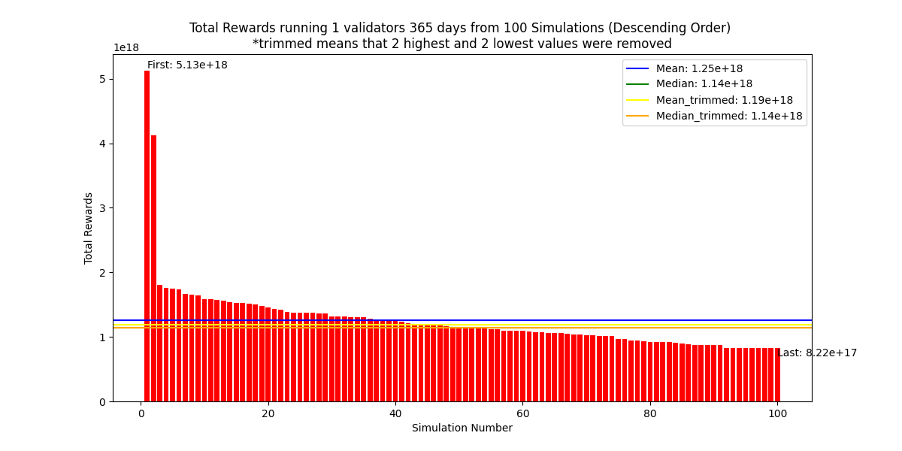
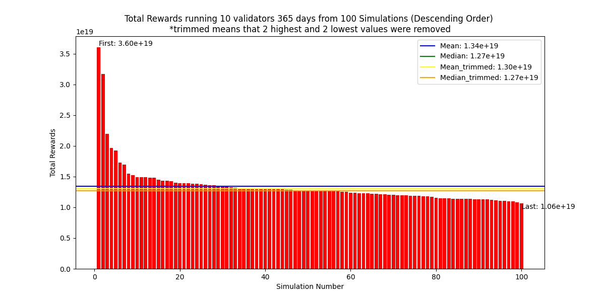
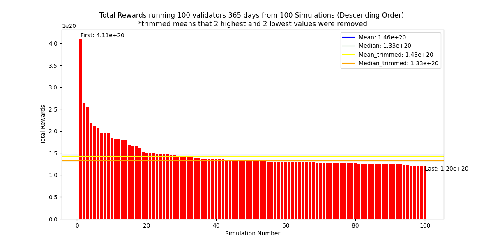
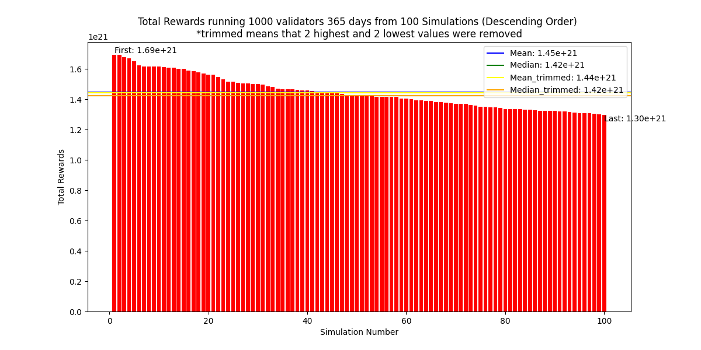
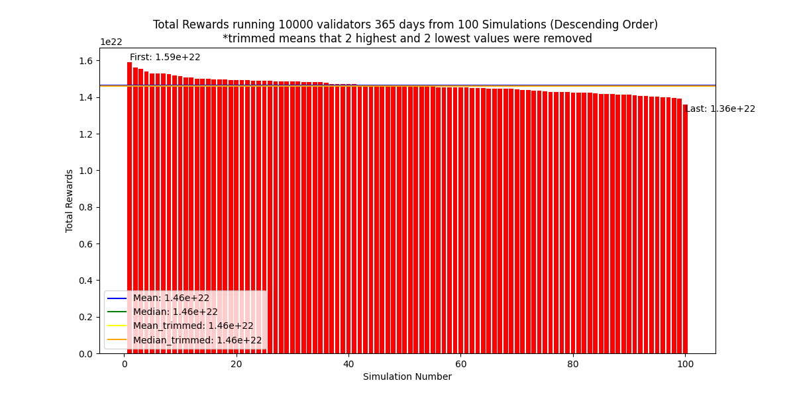

# Modeling the Profitability of running different number of Validators

## Overview

This analysis attempts to quantify the effect of large numbers in Ethereum staking. What is the difference in the expected profit under various sizes of validator pools.

It is useful to reason about a profitability of running solo validators versus joining a validator pool.

## Limits of this model

The model does not take into the account rewards compounding which would agreviate the situation even further and show larger differences in expected profits.

This models uses hardcoded values for consensus rewards. This is not a big issue, since we are looking for the delta in profits, not the final expected profit. This is in fact gives the more conservative estimate as the reality would.
This is the case if we expect the ETH staked amount will increase or at least stay the same. In case ETH staked continues to rise the differences would be further pronounced as consensus rewards would go down and execution rewards would be making larger portion of the overall fee.

As it is sampling historical MEV data to get the execution rewards for the block, the assumption is that the size and distribution of MEV rewards will not change. This may not be reasonable to expect in the long term (5+ years), but reasonable in short term(1 year).

## Results

The important result that this analysis was trying to get at was the difference between expected rewards, when running different amounts of Validators. In practice this reflects the rewards of big staking pools (running 1000-10000 validators) and solo validators (running 1-10 validators).

### Comparing medians across the simulations

The value that best reflect this is **median** value since to pick one simulation at random from the dataset is what actually happens in practice when NO is running their operation.

As could be expected, the median profit is monotonically increasing as num. of validators increases, up to the point of running 10000 validators when it plateaus. We can clearly see that also from the fact that median approximates mean better and better, as the num. of validators grow and these two values are practically equeal at 10000.

### Comparing median profit to base case (running 1 validator)

It is insightful to see and compare how much higher is the expected profit when compared to the base case of running one validator.

| num. of validators | median profit | relative difference |
| ------------------ | ------------- | ------------------- |
| 1                  | 1.14          | 0%                  |
| 10                 | 1.27          | 11%                 |
| 100                | 1.33          | 17%                 |
| 1000               | 1.42          | 25%                 |
| 10000              | 1.46          | 28%                 |

The sharpest difference can be observed between 1 and 10000 validators where **the expected profit is 28% higher** as in the latter is (1.46/1.14).

For more information see the graphs below

### Interpretations

The large difference in expected rewards is due mainly to the distribution of MEV rewards. There is a very large power law distribution in it, where the hundreth
percentile contains 45% of all MEV rewards for the whole set. In practice there are very few very large jackpots to be had. Due to this very small chance of receiving very large block reward, small operators usually don't get their share of this this juicy MEV jackpot.

### Recommendations

On average it is much more profitable to run large number of operators. If this is not possible smoothing pool is the next best option.

<!--

[Download a pdf of the report](https://github.com/htimsk/SPanalysis/raw/main/report/Analysis%20of%20the%20Smoothing%20Pool.pdf)

[Google docs version for commenting](https://docs.google.com/document/d/1dTYbES2mypo06R7Bd1LOzYpGnkHyU0TVWd6Vat9HIGI/edit?usp=sharing) -->

This analytical report and the associated code in this repository are available under the BB CY license.
